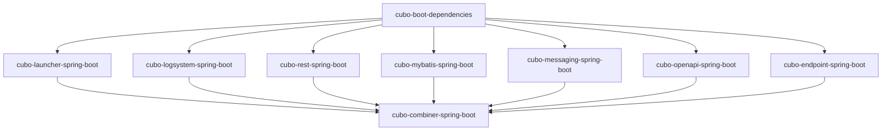

# Cubo Starter 总体设计文档

## 概述

Cubo Starter 是基于 Spring Boot 3.x 的企业级 Starter 组件集合，为 Java 开发者提供开箱即用的技术栈解决方案。该项目采用模块化设计，每个模块都包含
core、autoconfigure 和 starter 子模块，并集成了 SPI 逻辑用于组件初始化配置。

## 1. 设计思想

### 1.1 核心理念

- **约定大于配置**：通过合理的默认配置减少用户配置工作量
- **开箱即用**：基于 Spring Boot 自动配置，零配置即可使用
- **模块化设计**：每个模块独立，可按需引入
- **高度可配置**：丰富的配置选项，满足不同场景需求

### 1.2 设计原则

1. **单一职责原则**：每个模块专注于特定功能领域
2. **开闭原则**：对扩展开放，对修改封闭
3. **依赖倒置原则**：依赖抽象而非具体实现
4. **接口隔离原则**：提供细粒度的接口设计

## 2. 统一的分层结构

### 2.1 三层架构设计

每个 Starter 模块都采用统一的三层架构设计：

```
cubo-{name}-spring-boot/
├── cubo-{name}-spring-boot-core/             # 核心功能层
│   ├── cubo-{name}-common/                   # 通用组件
│   ├── cubo-{name}-{module1}/                # 具体实现模块1
│   └── cubo-{name}-{module2}/                # 具体实现模块2
├── cubo-{name}-spring-boot-autoconfigure/    # 自动配置层
└── cubo-{name}-spring-boot-starter/          # 启动器层
    ├── cubo-{name}-{module1}-spring-boot-starter/
    └── cubo-{name}-{module2}-spring-boot-starter/
```

### 2.2 各层职责

| 层级                 | 职责              | 特点                   | 依赖关系                  |
|--------------------|-----------------|----------------------|-----------------------|
| **Core层**          | 纯业务逻辑实现         | 不依赖Spring Boot，可独立使用 | 依赖 blen-kernel-common |
| **Autoconfigure层** | Spring Boot集成逻辑 | 处理自动装配、条件装配          | 依赖 Core层              |
| **Starter层**       | 依赖管理            | 简化用户配置，只包含pom.xml    | 依赖 Autoconfigure层     |

### 2.3 设计优势

1. **职责分离清晰**：每层都有明确的职责边界
2. **复用性强**：Core层可在非Spring Boot环境中使用
3. **扩展性好**：支持用户自定义覆盖默认配置
4. **维护性强**：模块化设计便于维护和升级
5. **测试友好**：各层可独立进行单元测试

## 3. 规范的自动装配和配置类写法

### 3.1 自动配置类规范

#### 基础结构

```java
@Slf4j
@AutoConfiguration
@ConditionalOnClass({核心类.class})
@ConditionalOnEnabled(value = Properties.PREFIX)
@EnableConfigurationProperties(Properties.class)
public class ModuleAutoConfiguration implements ZekaAutoConfiguration {

    public ModuleAutoConfiguration() {
        log.info("启动自动配置: [{}]", this.getClass());
    }

    @Override
    public LibraryEnum getLibraryType() {
        return LibraryEnum.MODULE_TYPE;
    }

    @Bean
    @Primary
    @ConditionalOnMissingBean
    public ComponentBean componentBean() {
        return new ComponentBean();
    }
}
```

#### 注解规范

| 注解                               | 用途       | 示例                                                     |
|----------------------------------|----------|--------------------------------------------------------|
| `@AutoConfiguration`             | 标识自动配置类  | `@AutoConfiguration`                                   |
| `@ConditionalOnClass`            | 类路径条件    | `@ConditionalOnClass(OkHttpClient.class)`              |
| `@ConditionalOnEnabled`          | 自定义启用条件  | `@ConditionalOnEnabled(value = RestProperties.PREFIX)` |
| `@EnableConfigurationProperties` | 启用配置属性   | `@EnableConfigurationProperties(RestProperties.class)` |
| `@ConditionalOnMissingBean`      | 缺失Bean条件 | `@ConditionalOnMissingBean`                            |
| `@Primary`                       | 主要Bean标识 | `@Primary`                                             |

### 3.2 配置属性类规范

#### 基础结构

```java
@Getter
@Setter
@RefreshScope
@ConfigurationProperties(prefix = Properties.PREFIX)
public class Properties extends ZekaProperties {
    public static final String PREFIX = ConfigKey.PREFIX + "module";

    /** 功能开关 */
    private boolean enabled = true;
    /** 超时配置 */
    private Integer timeout = 5000;
    /** 连接池配置 */
    private ConnectionPool connectionPool = new ConnectionPool();

    @Data
    public static class ConnectionPool {
        private Integer maxIdleConnections = 5;
        private Integer keepAliveDuration = 5;
    }
}
```

#### 配置属性规范

1. **继承 ZekaProperties**：统一配置基类
2. **使用 @RefreshScope**：支持配置热更新
3. **提供默认值**：减少用户配置工作量
4. **嵌套配置类**：复杂配置使用内部类
5. **常量定义**：配置前缀使用常量定义

### 3.3 条件装配规范

#### 条件注解使用

```java
// 类路径条件
@ConditionalOnClass(OkHttpClient.class)

// 属性条件
@ConditionalOnProperty(
    prefix = "zeka-stack.module",
    name = "enabled",
    havingValue = "true",
    matchIfMissing = true
)

// 自定义条件
@ConditionalOnEnabled(value = RestProperties.PREFIX)

// 环境条件
@Profile("prod")
```

#### 条件装配原则

1. **精确匹配**：使用最精确的条件注解
2. **默认启用**：提供合理的默认启用条件
3. **环境适配**：根据环境提供不同配置
4. **依赖检查**：确保依赖组件存在

## 4. SPI 加载组件的默认配置机制

### 4.1 SPI 机制设计

#### LauncherInitiation 接口

```java
public interface LauncherInitiation {
    /**
     * 设置默认配置属性
     */
    Map<String, Object> setDefaultProperties(ConfigurableEnvironment env,
                                           String appName,
                                           boolean isLocalLaunch);

    /**
     * 应用启动后处理
     */
    void after(ConfigurableApplicationContext context, Boolean localLaunch);

    /**
     * 获取执行顺序
     */
    int getOrder();
}
```

#### SPI 加载机制

```java
// 加载自定义 SPI 组件
ServiceLoader<LauncherInitiation> loader = ServiceLoader.load(LauncherInitiation.class);
launcherInitiations = CollectionUtils.toList(loader)
    .stream()
    .sorted(Comparator.comparingInt(LauncherInitiation::getOrder))
    .collect(Collectors.toList());

// 执行初始化逻辑
launcherInitiations.forEach(launcherService ->
    launcherService.launcherWrapper(environment, defaultProperties, appName, isLocalLaunch));
```

### 4.2 默认配置策略

#### 配置加载顺序

1. **系统默认配置**：框架基础配置
2. **SPI 组件配置**：各模块的默认配置
3. **用户自定义配置**：application.yml 中的配置
4. **环境变量配置**：系统环境变量

#### 配置优先级

```
环境变量 > 用户配置 > SPI默认配置 > 系统默认配置
```

### 4.3 约定大于配置的实现

#### 默认配置示例

```java
@AutoService(LauncherInitiation.class)
public class RestLauncherInitiation extends LauncherInitiation {

    @Override
    public Map<String, Object> setDefaultProperties(ConfigurableEnvironment env,
                                                   String appName,
                                                   boolean isLocalLaunch) {
        return ChainMap.build(8)
            // Undertow 服务器配置
            .put("server.undertow.threads.worker", 200)
            .put("server.undertow.threads.io", 8)
            .put("server.undertow.buffer-size", 1024)
            .put("server.undertow.direct-buffers", true)
            // Spring MVC 配置
            .put("spring.http.encoding.charset", "UTF-8")
            .put("spring.http.encoding.enabled", true)
            .put("spring.http.encoding.force", true)
            // Jackson 配置
            .put("spring.jackson.default-property-inclusion", "non_null")
            .put("spring.jackson.date-format", "yyyy-MM-dd HH:mm:ss")
            .put("spring.jackson.time-zone", "GMT+8");
    }
}
```

#### 配置减少策略

1. **合理默认值**：提供生产环境可用的默认配置
2. **环境适配**：根据环境自动调整配置
3. **智能检测**：根据类路径自动启用功能
4. **配置合并**：多个模块配置自动合并

## 5. 模块组织架构

### 5.1 整体模块结构

```
cubo-starter/
├── cubo-boot-dependencies/              # 依赖管理模块
├── cubo-launcher-spring-boot/           # 应用启动器
├── cubo-logsystem-spring-boot/          # 日志系统
├── cubo-messaging-spring-boot/          # 消息处理
├── cubo-mybatis-spring-boot/            # 数据访问
├── cubo-openapi-spring-boot/            # API 文档
├── cubo-rest-spring-boot/               # REST API
├── cubo-endpoint-spring-boot/           # 端点管理
├── cubo-combiner-spring-boot/           # 组合器模块
└── templates/                           # 模块生成工具
```

### 5.2 模块依赖关系



### 5.3 模块分类

#### 基础模块

- **cubo-launcher-spring-boot**：应用启动器
- **cubo-boot-dependencies**：依赖管理

#### 功能模块

- **cubo-logsystem-spring-boot**：日志系统
- **cubo-rest-spring-boot**：REST API
- **cubo-mybatis-spring-boot**：数据访问
- **cubo-messaging-spring-boot**：消息处理
- **cubo-openapi-spring-boot**：API 文档
- **cubo-endpoint-spring-boot**：端点管理

#### 组合模块

- **cubo-combiner-spring-boot**：组合器模块

## 6. 技术亮点

### 6.1 统一的分层架构

- **标准化结构**：所有模块采用统一的三层架构
- **职责清晰**：每层都有明确的职责边界
- **易于维护**：模块化设计便于代码维护

### 6.2 规范的自动配置

- **标准化注解**：统一的自动配置类写法
- **条件装配**：精确的条件装配机制
- **配置属性**：规范的配置属性类设计

### 6.3 SPI 加载机制

- **约定大于配置**：通过默认配置减少用户配置
- **模块化加载**：各模块独立提供默认配置
- **优先级管理**：合理的配置加载优先级

### 6.4 开箱即用

- **零配置启动**：提供合理的默认配置
- **智能检测**：根据类路径自动启用功能
- **环境适配**：根据环境自动调整配置

## 7. 最佳实践

### 7.1 模块设计

1. **单一职责**：每个模块专注于特定功能领域
2. **松耦合**：模块间依赖最小化
3. **高内聚**：模块内部功能紧密相关
4. **可测试**：支持单元测试和集成测试

### 7.2 配置设计

1. **合理默认值**：提供生产环境可用的默认配置
2. **环境适配**：根据环境自动调整配置
3. **配置验证**：提供配置参数验证
4. **文档完善**：提供详细的配置文档

### 7.3 扩展设计

1. **接口抽象**：提供清晰的接口定义
2. **SPI 机制**：支持插件化扩展
3. **条件装配**：支持功能的条件启用
4. **配置覆盖**：支持用户自定义配置

## 8. 未来规划

### 8.1 功能扩展

- **更多技术栈支持**：支持更多第三方技术栈
- **云原生支持**：增强云原生环境支持
- **监控集成**：集成更多监控和观测工具
- **安全增强**：提供更多安全防护功能

### 8.2 架构优化

- **性能优化**：持续优化启动性能和运行时性能
- **内存优化**：减少内存占用和垃圾回收压力
- **配置优化**：进一步简化配置复杂度
- **文档完善**：提供更详细的文档和示例

### 8.3 生态建设

- **社区建设**：建设活跃的开源社区
- **示例项目**：提供更多示例项目
- **最佳实践**：总结和分享最佳实践
- **工具支持**：提供更多开发工具支持

## 9. 总结

Cubo Starter 通过统一的分层架构、规范的自动配置、SPI 加载机制等设计，实现了"约定大于配置"的理念，为 Java
开发者提供了开箱即用的企业级技术栈解决方案。其模块化设计、标准化规范、智能化配置等特点，大大简化了 Spring Boot 应用的开发工作，提高了开发效率和代码质量。

