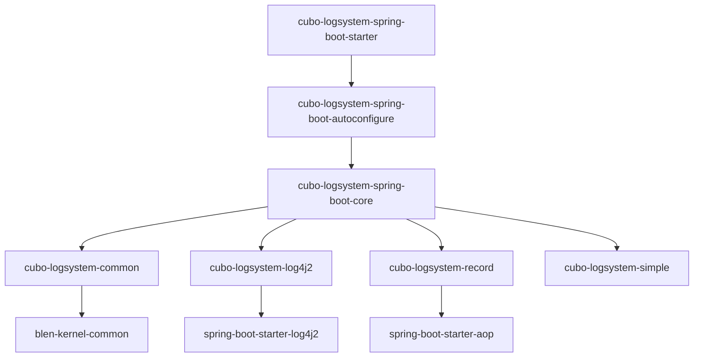

# Cubo LogSystem Spring Boot 组件设计文档

## 概述

`cubo-logsystem-spring-boot` 是 Zeka Stack 项目中的日志系统模块，提供了完整的日志解决方案。该模块采用分层架构设计，支持多种日志框架，并提供了日志级别动态刷新、审计日志记录等高级功能。

## 1. 架构设计

### 1.1 分层架构

该模块采用了经典的三层架构设计，体现了**关注点分离**和**职责单一**的设计原则：

```
cubo-logsystem-spring-boot/
├── cubo-logsystem-spring-boot-core/          # 核心功能层
│   ├── cubo-logsystem-common/                # 通用组件
│   ├── cubo-logsystem-log4j2/                # Log4j2实现
│   ├── cubo-logsystem-record/                # 审计日志
│   └── cubo-logsystem-simple/                # 简单日志实现
├── cubo-logsystem-spring-boot-autoconfigure/ # 自动配置层
└── cubo-logsystem-spring-boot-starter/       # 启动器层
```

#### 各层职责

| 层级                 | 职责              | 特点                   |
|--------------------|-----------------|----------------------|
| **Core层**          | 纯业务逻辑实现         | 不依赖Spring Boot，可独立使用 |
| **Autoconfigure层** | Spring Boot集成逻辑 | 处理自动装配、条件装配          |
| **Starter层**       | 依赖管理            | 简化用户配置，只包含pom.xml    |

#### 设计优势

1. **职责分离清晰**：每层都有明确的职责边界
2. **复用性强**：Core层可在非Spring Boot环境中使用
3. **扩展性好**：支持多种日志实现，满足不同场景需求
4. **维护性强**：分层设计便于代码维护和功能扩展

### 1.2 模块依赖关系



## 2. 技术选型与实现

### 2.1 Log4j2 vs Logback 选型

#### 选择 Log4j2 的原因

1. **性能优势**
    - **异步日志性能**：基于 Disruptor 的异步日志，性能远超 Logback
    - **垃圾回收友好**：Log4j2 2.6+ 支持无垃圾日志记录
    - **内存使用优化**：更高效的内存管理机制

2. **功能丰富**
    - 支持更灵活的配置方式
    - 提供更强大的插件系统
    - 支持自定义日志级别和转换器

3. **配置灵活性**
    - 支持 XML、JSON、YAML 等多种配置格式
    - 支持配置文件的模块化组织
    - 支持运行时配置重载

#### 性能配置优化

```properties
# 开启全量异步日志
Log4jContextSelector=org.apache.logging.log4j.core.async.AsyncLoggerContextSelector
# 环形队列大小
log4j2.asyncLoggerRingBufferSize=4096
# 队列满时丢弃策略
log4j2.asyncQueueFullPolicy=Discard
# 丢弃DEBUG级别日志
log4j2.DiscardThreshold=DEBUG
```

### 2.2 配置设计精妙之处

#### 模块化配置

通过 `<xi:include>` 实现配置文件的模块化组织：

```xml
<Appenders>
    <xi:include href="appender-console.xml"/>
    <xi:include href="appender-file-all.xml"/>
    <xi:include href="appender-access.xml"/>
    <xi:include href="appender-sql.xml"/>
</Appenders>
```

#### 环境差异化配置

**本地开发环境**：

- 默认开启 `includeLocation`，便于调试定位
- 使用彩色控制台输出
- 详细的日志格式

**生产环境**：

- 关闭位置信息，避免性能损耗
- 文件日志输出
- 简化的日志格式

```java
private void setShowLogLocation(boolean isLocalLaunch) {
    // 本地开发环境且未配置时，默认开启位置显示
    if (isLocalLaunch && StringUtils.isBlank(showLogLocation)) {
        showLogLocation = ConfigDefaultValue.TRUE_STRING;
    }

    // 关闭位置显示时，替换布局格式为简化版本
    if (!enableShowLocation) {
        System.setProperty(Constants.SHOW_LOG_LOCATION_LAYOUT, "%clr{%c{1.}}{cyan}");
    }
}
```

### 2.3 SLF4J 简单实现

`cubo-logsystem-simple` 是基于 SLF4J Simple 的定制化实现，主要特点：

#### 设计目的

- 作为 Log4j2 的备选方案
- 在 Log4j2 不可用时提供基础日志功能
- 支持自定义日志输出格式

#### 核心特性

1. **轻量级实现**：无外部依赖，减少包体积
2. **SLF4J 兼容**：完全兼容 SLF4J 接口
3. **灵活配置**：支持多种输出格式和配置选项
4. **性能优化**：针对简单场景的性能优化

#### 配置支持

```properties
# 默认日志级别
org.slf4j.simpleLogger.defaultLogLevel=INFO
# 显示日期时间
org.slf4j.simpleLogger.showDateTime=true
# 日期时间格式
org.slf4j.simpleLogger.dateTimeFormat=yyyy-MM-dd HH:mm:ss:SSS
# 显示线程名
org.slf4j.simpleLogger.showThreadName=true
# 显示日志名
org.slf4j.simpleLogger.showLogName=true
```

## 3. 审计日志模块设计

### 3.1 面向接口编程设计

审计日志模块采用了优雅的**面向接口编程**设计，体现了**关注点分离**的设计原则。

#### 核心接口设计

```java
public interface LogStorageFactory {
    LogStorageService getLogStorageService();
    ILogStorage<SystemLog> getSystemLogStorage();
    ILogStorage<ErrorLog> getErrorLogStorage();
    ILogStorage<ApiLog> getApiLogStorage();
}
```

#### 设计优势

1. **职责分离**
    - **框架负责**：日志收集、解析、事件发布
    - **业务负责**：日志存储实现

2. **使用简单**
   ```java
   @RestLog("用户登录接口")
   @PostMapping("/login")
   public Result login(@RequestBody LoginDTO loginDTO) {
       // 业务逻辑
   }
   ```

3. **存储灵活**
   ```java
   @Component
   public class CustomLogStorageFactory extends LogStorageFactoryAdapter {
       @Override
       public LogStorageService getLogStorageService() {
           return new DatabaseLogStorageService(); // 存储到数据库
           // 或者 return new ElasticsearchLogStorageService(); // 存储到ES
       }
   }
   ```

### 3.2 事件驱动架构

采用 Spring 事件机制实现日志的异步处理：

```java
@Around("@annotation(restLog)")
public Object restLogAround(@NotNull ProceedingJoinPoint point, RestLog restLog) throws Throwable {
    // 执行方法
    Object result = point.proceed();
    // 发布日志事件
    ApiLogPublisher.publishEvent(methodName, className, restLog, stopWatch.getTotalTimeMillis());
    return result;
}
```

### 3.3 日志类型支持

| 日志类型          | 用途      | 特点               |
|---------------|---------|------------------|
| **ApiLog**    | API接口日志 | 记录请求参数、响应时间、状态码等 |
| **SystemLog** | 系统操作日志  | 记录用户操作行为，用于审计    |
| **ErrorLog**  | 错误日志    | 记录异常信息，用于问题排查    |

## 4. 高级特性

### 4.1 动态日志级别刷新

支持运行时动态调整日志级别，无需重启应用。

#### 双环境支持

**Spring Boot 环境**：

- 文件监听 + 配置刷新
- 支持配置文件变更自动重载

**Spring Cloud 环境**：

- 配置中心事件驱动
- 支持配置中心推送的日志级别变更

#### 精准刷新机制

```java
@Override
protected Map<String, String> changedLevels(EnvironmentChangeEvent event) {
    return Binder.get(this.environment)
        .bind(ConfigKey.PREFIX + "logging.level", STRING_STRING_MAP)
        .orElseGet(Collections::emptyMap);
}
```

### 4.2 日志级别分组管理

支持将多个 Logger 组织成逻辑分组，便于统一管理：

```yaml
zeka-stack:
  logging:
    group:
      test: sample.logsystem, sample.launcher
      web: org.springframework.web, org.springframework.boot.web
    level:
      test: info
      web: debug
```

### 4.3 系统输出流重定向

通过 `LogPrintStream` 将系统输出重定向到日志系统：

```java
public final class LogPrintStream extends PrintStream {
    @Override
    public void print(String s) {
        if (error) {
            log.error(s);
        } else {
            log.info(s);
        }
    }
}
```

## 5. 配置属性

### 5.1 核心配置

| 属性名                                       | 类型      | 默认值   | 说明            |
|-------------------------------------------|---------|-------|---------------|
| `zeka-stack.logging.enabled`              | boolean | true  | 是否启用日志系统      |
| `zeka-stack.logging.app-name`             | String  | -     | 应用名称，用于区分日志目录 |
| `zeka-stack.logging.config`               | String  | -     | 日志配置文件名称      |
| `zeka-stack.logging.enable-show-location` | boolean | false | 是否显示日志位置信息    |

### 5.2 日志级别配置

| 属性名                                    | 类型     | 默认值   | 说明       |
|----------------------------------------|--------|-------|----------|
| `zeka-stack.logging.level.root`        | String | INFO  | 根日志级别    |
| `zeka-stack.logging.level.com.example` | String | DEBUG | 特定包的日志级别 |

### 5.3 审计日志配置

| 属性名                                 | 类型      | 默认值   | 说明         |
|-------------------------------------|---------|-------|------------|
| `zeka-stack.logging.record.enabled` | boolean | false | 是否启用日志记录功能 |

## 6. 使用方式

### 6.1 引入依赖

**使用 Log4j2**：

```xml
<dependency>
    <groupId>dev.dong4j</groupId>
    <artifactId>cubo-logsystem-log4j2-spring-boot-starter</artifactId>
</dependency>
```

**使用审计日志**：

```xml
<dependency>
    <groupId>dev.dong4j</groupId>
    <artifactId>cubo-logsystem-record-spring-boot-starter</artifactId>
</dependency>
```

### 6.2 配置启用

```yaml
zeka-stack:
  logging:
    enabled: true
    refresh-log-level:
      enabled: true
    record:
      enabled: true

logging:
  level:
    root: INFO
    com.example: DEBUG
```

### 6.3 使用示例

```java
@RestController
public class ExampleController {

    private static final Logger log = LoggerFactory.getLogger(ExampleController.class);

    @GetMapping("/example")
    public String example() {
        log.debug("处理请求开始");
        log.info("处理业务逻辑");
        return "success";
    }
}
```

## 7. 最佳实践

### 7.1 日志级别使用

- **ERROR**：系统错误，需要立即处理
- **WARN**：警告信息，可能影响系统运行
- **INFO**：重要的业务信息
- **DEBUG**：调试信息，仅在开发环境使用
- **TRACE**：详细的跟踪信息

### 7.2 性能优化

1. **使用异步日志**：提高性能，减少I/O阻塞
2. **合理设置日志级别**：避免过多日志输出
3. **使用合适的日志格式**：避免复杂的字符串拼接
4. **生产环境关闭位置信息**：避免性能损耗

### 7.3 日志管理

1. **定期清理日志文件**：避免磁盘空间不足
2. **使用日志聚合工具**：便于日志分析和监控
3. **设置合适的日志滚动策略**：平衡存储空间和查询性能

## 8. 总结

`cubo-logsystem-spring-boot` 模块通过精心设计的架构和丰富的功能特性，为 Zeka Stack
提供了完整的日志解决方案。其分层架构设计、技术选型考量、审计日志的面向接口编程设计以及动态配置等高级特性，都体现了优秀的软件工程实践和架构设计思维。

该模块不仅解决了日志系统的技术问题，更重要的是通过降低使用门槛、提升开发效率、保证生产稳定性，为整个 Zeka Stack 生态提供了坚实的日志基础设施支撑。
